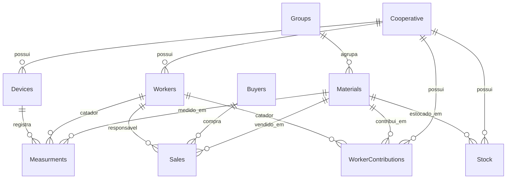

# Modelo de dados

Fonte de verdade atual: `prisma/schema.prisma`. O banco usa PostgreSQL e o datasource Prisma depende de `DATABASE_URL`.

ADR vigente: [[ADR/ADR-0001-schema-prisma-baseline-rollback]]. O schema fisico legado com tabelas capitalizadas permanece canonico para entidades existentes; novas capacidades da portabilidade entram por migrations Prisma aditivas, com tabelas novas em lower-case snake_case quando nao houver tabela legado equivalente.

## Visao relacional

## Modelos Prisma

### Cooperative

Tabela: `Cooperative`

| Campo Prisma | Coluna SQL | Tipo | Observacao |
| --- | --- | --- | --- |
| `cooperativeId` | `cooperative_id` | `BigInt` | PK autoincremento |
| `cooperativeName` | `cooperative_name` | `String` | Nome exibido no app |

Relacionamentos: `devices`, `workers`, `stock`, `contributions`.

### Devices

Tabela: `Devices`

| Campo Prisma | Coluna SQL | Tipo | Observacao |
| --- | --- | --- | --- |
| `deviceId` | `device_id` | `BigInt` | PK autoincremento |
| `cooperativeId` | `cooperative_id` | `BigInt` | FK para `Cooperative` |

Relacionamentos: pertence a `Cooperative`, possui `Measurments`.

### Groups

Tabela: `Groups`

| Campo Prisma | Coluna SQL | Tipo | Observacao |
| --- | --- | --- | --- |
| `groupId` | `Group_id` | `BigInt` | PK autoincremento |
| `groupName` | `Group_name` | `String` | Nome do grupo de materiais |

Relacionamentos: possui `Materials`.

### Materials

Tabela: `Materials`

| Campo Prisma | Coluna SQL | Tipo | Observacao |
| --- | --- | --- | --- |
| `materialId` | `Material_id` | `BigInt` | PK autoincremento |
| `materialName` | `Material_name` | `String` | Nome do material |
| `materialGroup` | `Material_group` | `BigInt?` | FK opcional para `Groups` |

Relacionamentos: grupo, vendas, medicoes, estoque e contribuicoes.

### Buyers

Tabela: `Buyers`

| Campo Prisma | Coluna SQL | Tipo | Observacao |
| --- | --- | --- | --- |
| `buyerId` | `Buyer_id` | `BigInt` | PK autoincremento |
| `buyerName` | `Buyer_name` | `String` | Nome do comprador |

Relacionamentos: possui `Sales`.

### Sales

Tabela: `Sales`

| Campo Prisma | Coluna SQL | Tipo | Observacao |
| --- | --- | --- | --- |
| `saleId` | `Sale_id` | `BigInt` | PK autoincremento |
| `date` | `Date` | `DateTime @db.Date` | Data da venda |
| `material` | `Material` | `BigInt` | FK para `Materials` |
| `weight` | `Weight` | `Decimal(10,2)` | Peso vendido em kg |
| `priceKg` | `Price_Kg` | `Decimal(10,2)` | Preco por kg |
| `buyer` | `Buyer` | `BigInt` | FK para `Buyers` |
| `responsible` | `Responsible` | `BigInt` | FK para `Workers` |

Relacionamentos: `materialRef`, `buyerRef`, `responsibleRef`.

### Workers

Tabela: `Workers`

| Campo Prisma | Coluna SQL | Tipo | Observacao |
| --- | --- | --- | --- |
| `workerId` | `Worker_id` | `BigInt` | PK autoincremento |
| `workerName` | `Worker_name` | `String` | Nome completo |
| `cooperative` | `Cooperative` | `BigInt` | FK para cooperativa |
| `cpf` | `CPF` | `Bytes` | Armazenado como bytes UTF-8 de digitos |
| `userType` | `User_type` | `String @db.Char(1)` | `0` gerente, `1` catador; helpers tambem aceitam letras |
| `birthDate` | `Birth_date` | `DateTime @db.Date` | Data de nascimento |
| `enterDate` | `Enter_date` | `DateTime @db.Date` | Data de entrada |
| `exitDate` | `Exit_date` | `DateTime? @db.Date` | Data de saida opcional |
| `pis` | `PIS` | `Bytes` | PIS/NIS em bytes |
| `rg` | `RG` | `Bytes` | RG em bytes |
| `gender` | `Gender` | `String?` | Genero opcional |
| `password` | `Password` | `Bytes` | Hash bcrypt ou valor legado comparado como texto no login |
| `email` | `Email` | `String` | Email |
| `lastUpdate` | `Last_update` | `DateTime? @db.Date` | Ultima atualizacao |

Relacionamentos: cooperativa, medicoes, vendas responsaveis e contribuicoes.

### Measurments

Tabela: `Measurments` com grafia observada no schema.

| Campo Prisma | Coluna SQL | Tipo | Observacao |
| --- | --- | --- | --- |
| `weightingId` | `Weighting_id` | `BigInt` | PK autoincremento |
| `weightKg` | `Weight_KG` | `Decimal(10,2)` | Peso medido |
| `timeStamp` | `Time_stamp` | `DateTime @db.Date` | Data da medicao |
| `wastepicker` | `Wastepicker` | `BigInt` | FK para `Workers` |
| `material` | `Material` | `BigInt` | FK para `Materials` |
| `device` | `Device` | `BigInt` | FK para `Devices` |
| `bagFilled` | `Bag_filled` | `Boolean` | Indica saco cheio |

### Stock

Tabela: `Stock`

| Campo Prisma | Coluna SQL | Tipo | Observacao |
| --- | --- | --- | --- |
| `stockId` | `Stock_id` | `BigInt` | PK autoincremento |
| `cooperative` | `Cooperative` | `BigInt` | FK para cooperativa |
| `material` | `Material` | `BigInt` | FK para material |
| `totalCollectedKg` | `Total_collected_KG` | `Decimal(65,2)` | Total coletado |
| `totalSoldKg` | `Total_sold_KG` | `Decimal(65,2)` | Total vendido |
| `currentStockKg` | `Current_stock_KG` | `Decimal(45,2)` | Estoque atual |

### WorkerContributions

Tabela: `Worker_contributions`

| Campo Prisma | Coluna SQL | Tipo | Observacao |
| --- | --- | --- | --- |
| `contributionId` | `Contribution_id` | `BigInt` | PK autoincremento |
| `wastepicker` | `Wastepicker` | `BigInt` | FK para `Workers` |
| `material` | `Material` | `BigInt` | FK para `Materials` |
| `cooperative` | `cooperative` | `BigInt` | FK para `Cooperative` |
| `period` | `Period` | `Unsupported("daterange")` | Range PostgreSQL |
| `weightKg` | `Weight_KG` | `Decimal(15,2)` | Peso da contribuicao |
| `lastUpdated` | `Last_updated` | `DateTime? @db.Date` | Ultima atualizacao |

## Arquivos relacionados

- `prisma/schema.prisma`: schema Prisma atual.
- `prisma/migrations/00000000000000_baseline/migration.sql`: baseline versionada do schema legado atual.
- `New_db_schema.sql`: SQL gerado por pgAdmin com tabelas e FKs. Diverge em algumas precisões numericas, mas expressa a estrutura SQL original.
- `prisma/seed.ts`: apaga dados por `TRUNCATE ... CASCADE` e recria cooperativas, grupos, materiais, dispositivos, compradores, usuarios, medicoes, vendas, estoque e contribuicoes.
- `src/lib/db-utils.ts`: conversao de `Bytes`, limpeza de digitos, `BigInt`, formatacao `WP###`, mapeamento de tipo de usuario e conversao de `Decimal`.
