# Modelo de dados

Fonte de verdade atual: `prisma/schema.prisma`. O banco usa PostgreSQL e o datasource Prisma depende de `DATABASE_URL`.

ADR vigente: [[ADR/ADR-0001-schema-prisma-baseline-rollback]]. O schema fisico legado com tabelas capitalizadas permanece canonico para entidades existentes; novas capacidades da portabilidade entram por migrations Prisma aditivas, com tabelas novas em lower-case snake_case quando nao houver tabela legado equivalente.

## Visao relacional

```mermaid
erDiagram
  Cooperative ||--o{ Devices : possui
  Cooperative ||--o{ Workers : possui
  Cooperative ||--o{ Sales : possui
  Cooperative ||--o{ Stock : possui
  Cooperative ||--o{ MaterialBagState : possui
  Cooperative ||--o{ WorkerContributions : possui
  Cooperative ||--o{ CollectiveSale : cria
  Cooperative ||--o{ CollectiveSaleContribution : participa
  Cooperative ||--o{ NoticeBoard : recebe
  Cooperative ||--o{ CooperativeMaterialMultiplier : configura
  Cooperative ||--|| CooperativeRandomMultiplier : possui
  Cooperative ||--o{ AchievementXpOverride : ajusta
  Cooperative ||--o{ WorkerAchievement : registra
  Cooperative ||--o{ LeaderboardSnapshot : historiza
  Groups ||--o{ Materials : agrupa
  Materials ||--o{ Sales : vendido_em
  Materials ||--o{ Measurments : medido_em
  Materials ||--o{ Stock : estocado_em
  Materials ||--o{ MaterialBagState : estado_de_saco
  Materials ||--o{ WorkerContributions : contribui_em
  Materials ||--o{ CollectiveSale : vendido_coletivamente
  Materials ||--o{ CooperativeMaterialMultiplier : bonifica
  Buyers ||--o{ Sales : compra
  Buyers ||--o{ CollectiveSale : compra_coletiva
  CollectiveSale ||--o{ CollectiveSaleContribution : possui
  Workers ||--o{ Sales : responsavel
  Workers ||--o{ Measurments : catador
  Workers ||--o{ WorkerContributions : catador
  Workers ||--o{ NoticeBoard : cria
  Workers ||--o{ AchievementXpOverride : atualiza
  Workers ||--o{ WorkerAchievement : conquista
  Workers ||--o{ LeaderboardEntry : aparece
  Workers ||--|| WorkerLevel : progride
  AchievementDefinition ||--o{ AchievementXpOverride : sobrescreve
  AchievementDefinition ||--o{ WorkerAchievement : desbloqueia
  LeaderboardSnapshot ||--o{ LeaderboardEntry : contem
  LevelDefinition ||--o{ WorkerLevel : define
  Devices ||--o{ Measurments : registra
```

## Modelos Prisma

### Cooperative

Tabela: `Cooperative`

| Campo Prisma | Coluna SQL | Tipo | Observacao |
| --- | --- | --- | --- |
| `cooperativeId` | `cooperative_id` | `BigInt` | PK autoincremento |
| `cooperativeName` | `cooperative_name` | `String` | Nome exibido no app |

Relacionamentos: `devices`, `workers`, `sales`, `stock`, `materialBagStates`, `contributions`, `collectiveSales`, `collectiveSaleContributions`, `notices`, `materialMultipliers`, `randomMultiplier`, `achievementXpOverrides`, `workerAchievements`, `leaderboardSnapshots`.

### Devices

Tabela: `Devices`

| Campo Prisma | Coluna SQL | Tipo | Observacao |
| --- | --- | --- | --- |
| `deviceId` | `device_id` | `BigInt` | PK autoincremento |
| `cooperativeId` | `cooperative_id` | `BigInt` | FK para `Cooperative` |

Relacionamentos: pertence a `Cooperative`, possui `Measurments`.

### Groups

Tabela: `Groups`

| Campo Prisma | Coluna SQL | Tipo | Observacao |
| --- | --- | --- | --- |
| `groupId` | `Group_id` | `BigInt` | PK autoincremento |
| `groupName` | `Group_name` | `String` | Nome do grupo de materiais |

Relacionamentos: possui `Materials`.

### Materials

Tabela: `Materials`

| Campo Prisma | Coluna SQL | Tipo | Observacao |
| --- | --- | --- | --- |
| `materialId` | `Material_id` | `BigInt` | PK autoincremento |
| `materialName` | `Material_name` | `String` | Nome do material |
| `materialGroup` | `Material_group` | `BigInt?` | FK opcional para `Groups` |

Relacionamentos: grupo, vendas normais, vendas coletivas, medicoes, estoque, estado fisico de saco, contribuicoes e multiplicadores por cooperativa.

### Buyers

Tabela: `Buyers`

| Campo Prisma | Coluna SQL | Tipo | Observacao |
| --- | --- | --- | --- |
| `buyerId` | `Buyer_id` | `BigInt` | PK autoincremento |
| `buyerName` | `Buyer_name` | `String` | Nome do comprador |

Relacionamentos: possui `Sales` e `CollectiveSale`.

### Sales

Tabela: `Sales`

| Campo Prisma | Coluna SQL | Tipo | Observacao |
| --- | --- | --- | --- |
| `saleId` | `Sale_id` | `BigInt` | PK autoincremento |
| `date` | `Date` | `DateTime @db.Date` | Data da venda |
| `material` | `Material` | `BigInt` | FK para `Materials` |
| `weight` | `Weight` | `Decimal(10,2)` | Peso vendido em kg |
| `priceKg` | `Price_Kg` | `Decimal(10,2)` | Preco por kg |
| `buyer` | `Buyer` | `BigInt` | FK para `Buyers` |
| `responsible` | `Responsible` | `BigInt` | FK para `Workers` |
| `createdAt` | `created_at` | `DateTime` | Criacao do registro |
| `soldAt` | `sold_at` | `DateTime?` | Preenchido quando a venda esta concluida |
| `cancelledAt` | `cancelled_at` | `DateTime?` | Preenchido quando a venda esta cancelada |
| `cooperativeId` | `cooperative_id` | `BigInt` | FK direta para `Cooperative`, derivada do responsavel no backfill |
| `expectedSaleDate` | `expected_sale_date` | `DateTime` | Data operacional esperada |

Relacionamentos: `materialRef`, `buyerRef`, `responsibleRef`, `cooperativeRef`.

Estado derivado: `ACTIVE` quando `soldAt` e `cancelledAt` estao nulos, `SOLD` quando `soldAt` esta preenchido e `CANCELLED` quando `cancelledAt` esta preenchido. A migration S1-01 bloqueia `sold_at` e `cancelled_at` preenchidos ao mesmo tempo.

### Workers

Tabela: `Workers`

| Campo Prisma | Coluna SQL | Tipo | Observacao |
| --- | --- | --- | --- |
| `workerId` | `Worker_id` | `BigInt` | PK autoincremento |
| `workerName` | `Worker_name` | `String` | Nome completo |
| `cooperative` | `Cooperative` | `BigInt` | FK para cooperativa |
| `cpf` | `CPF` | `Bytes` | Armazenado como bytes UTF-8 de digitos |
| `userType` | `User_type` | `String @db.Char(1)` | `0` gerente, `1` catador; helpers tambem aceitam letras |
| `birthDate` | `Birth_date` | `DateTime @db.Date` | Data de nascimento |
| `enterDate` | `Enter_date` | `DateTime @db.Date` | Data de entrada |
| `exitDate` | `Exit_date` | `DateTime? @db.Date` | Data de saida opcional |
| `pis` | `PIS` | `Bytes` | PIS/NIS em bytes |
| `rg` | `RG` | `Bytes` | RG em bytes |
| `gender` | `Gender` | `String?` | Genero opcional |
| `password` | `Password` | `Bytes` | Hash bcrypt ou valor legado comparado como texto no login |
| `email` | `Email` | `String` | Email |
| `lastUpdate` | `Last_update` | `DateTime? @db.Date` | Ultima atualizacao |

Relacionamentos: cooperativa, medicoes, vendas responsaveis, contribuicoes, notices criados, overrides de XP atualizados, achievements, entradas de ranking e nivel atual.

### Measurments

Tabela: `Measurments` com grafia observada no schema.

| Campo Prisma | Coluna SQL | Tipo | Observacao |
| --- | --- | --- | --- |
| `weightingId` | `Weighting_id` | `BigInt` | PK autoincremento |
| `weightKg` | `Weight_KG` | `Decimal(10,2)` | Peso medido |
| `timeStamp` | `Time_stamp` | `DateTime @db.Date` | Data da medicao |
| `wastepicker` | `Wastepicker` | `BigInt` | FK para `Workers` |
| `material` | `Material` | `BigInt` | FK para `Materials` |
| `device` | `Device` | `BigInt` | FK para `Devices` |
| `bagFilled` | `Bag_filled` | `Boolean` | Indica saco cheio |

### Stock

Tabela: `Stock`

| Campo Prisma | Coluna SQL | Tipo | Observacao |
| --- | --- | --- | --- |
| `stockId` | `Stock_id` | `BigInt` | PK autoincremento |
| `cooperative` | `Cooperative` | `BigInt` | FK para cooperativa |
| `material` | `Material` | `BigInt` | FK para material |
| `totalCollectedKg` | `Total_collected_KG` | `Decimal(65,2)` | Total coletado |
| `totalSoldKg` | `Total_sold_KG` | `Decimal(65,2)` | Total vendido |
| `currentStockKg` | `Current_stock_KG` | `Decimal(45,2)` | Estoque atual |

Contrato S1-01: par unico por `cooperative` + `material`; totais e estoque atual nao podem ser negativos.

### MaterialBagState

Tabela: `material_bag_state`

| Campo Prisma | Coluna SQL | Tipo | Observacao |
| --- | --- | --- | --- |
| `bagStateId` | `bag_state_id` | `BigInt` | PK autoincremento |
| `cooperativeId` | `cooperative_id` | `BigInt` | FK para `Cooperative` |
| `materialId` | `material_id` | `BigInt` | FK para `Materials` |
| `isBegun` | `is_begun` | `Boolean` | Indica se ha saco em andamento |
| `currentKg` | `current_kg` | `Decimal(10,2)` | Peso atual do saco |
| `lastUpdated` | `last_updated` | `DateTime` | Ultima alteracao |

Contrato S1-01: par unico por cooperativa/material, `current_kg >= 0` e saco vazio deve ter `current_kg = 0`.

### CollectiveSale

Tabela: `collective_sale`

| Campo Prisma | Coluna SQL | Tipo | Observacao |
| --- | --- | --- | --- |
| `collectiveSaleId` | `collective_sale_id` | `BigInt` | PK autoincremento |
| `createdAt` | `created_at` | `DateTime` | Criacao do registro |
| `soldAt` | `sold_at` | `DateTime?` | Preenchido quando a venda coletiva esta concluida |
| `cancelledAt` | `cancelled_at` | `DateTime?` | Preenchido quando a venda coletiva esta cancelada |
| `buyerId` | `buyer_id` | `BigInt` | FK para `Buyers` |
| `materialId` | `material_id` | `BigInt` | FK para `Materials` |
| `totalWeight` | `total_weight` | `Decimal(10,2)?` | Peso total vendido; obrigatorio quando `sold_at` estiver preenchido |
| `priceKg` | `price_kg` | `Decimal(10,2)` | Preco por kg; deve ser positivo |
| `expectedSaleDate` | `expected_sale_date` | `DateTime` | Data operacional esperada |
| `creatorCooperativeId` | `creator_cooperative_id` | `BigInt` | Cooperativa criadora |

Contrato S1-02: migration aditiva cria a tabela em snake_case, preserva FKs para as tabelas fisicas atuais (`Buyers`, `Materials`, `Cooperative`), impede `sold_at` e `cancelled_at` simultaneos, exige `price_kg > 0`, `total_weight > 0` quando informado e `total_weight` nao nulo para venda concluida.

### CollectiveSaleContribution

Tabela: `collective_sale_contribution`

| Campo Prisma | Coluna SQL | Tipo | Observacao |
| --- | --- | --- | --- |
| `contributionId` | `contribution_id` | `BigInt` | PK autoincremento |
| `collectiveSaleId` | `collective_sale_id` | `BigInt` | FK para `collective_sale` |
| `cooperativeId` | `cooperative_id` | `BigInt` | Cooperativa participante |
| `contributedWeight` | `contributed_weight` | `Decimal(10,2)?` | Peso reservado/contribuido pela cooperativa |
| `revenueShare` | `revenue_share` | `Decimal(10,2)?` | Receita atribuida na conclusao |
| `status` | `status` | `String @db.VarChar(20)` | `INVITED`, `ACCEPTED` ou `LEFT`; default `ACCEPTED` |

Contrato S1-02: par unico por venda coletiva/cooperativa, peso e receita nao podem ser negativos, convite (`INVITED`) permanece sem peso/receita e `revenue_share` so pode existir com peso positivo. A soma de contribuicoes, reserva de estoque e rateio final ficam para as APIs transacionais S3.

### NoticeBoard

Tabela: `notice_board`

| Campo Prisma | Coluna SQL | Tipo | Observacao |
| --- | --- | --- | --- |
| `noticeId` | `notice_id` | `BigInt` | PK autoincremento |
| `cooperativeId` | `cooperative_id` | `BigInt?` | Nulo representa aviso global |
| `createdAt` | `created_at` | `DateTime` | Criacao do aviso |
| `lastUpdated` | `last_updated` | `DateTime` | Ultima alteracao |
| `createdBy` | `created_by` | `BigInt` | FK para `Workers` |
| `priority` | `priority` | `Int` | Check S1-03: 1 a 3 |
| `expiresAt` | `expires_at` | `DateTime?` | Expiracao opcional |
| `title` | `title` | `String @db.Text` | Titulo sanitizado pelas APIs/seeds |
| `content` | `content` | `String @db.Text` | HTML limitado sanitizado pelas APIs/seeds |

Contrato S1-03: tabela aditiva em snake_case, FK opcional para `Cooperative`, FK obrigatoria para `Workers`, prioridade limitada a `1..3`, titulo/conteudo nao vazios e `last_updated >= created_at`. Avisos de cooperativa tambem usam FK composta `(created_by, cooperative_id)` para impedir autor de outra cooperativa; avisos globais mantem `cooperative_id` nulo e dependem de RBAC nas APIs. APIs e UI de notices ficam para S4.

### CooperativeMaterialMultiplier

Tabela: `cooperative_material_multiplier`

| Campo Prisma | Coluna SQL | Tipo | Observacao |
| --- | --- | --- | --- |
| `cooperativeMaterialMultiplierId` | `cooperative_material_multiplier_id` | `String @db.Uuid` | PK UUID gerado por `gen_random_uuid()` |
| `cooperativeId` | `cooperative_id` | `BigInt` | FK para `Cooperative` |
| `materialId` | `material_id` | `BigInt` | FK para `Materials` |
| `multiplierValue` | `multiplier_value` | `Decimal(5,3)` | Check S1-03: `0.100` a `10.000` |
| `lastUpdated` | `last_updated` | `DateTime` | Ultima alteracao |

Contrato S1-03: par unico por cooperativa/material para suportar upsert nas APIs futuras.

### CooperativeRandomMultiplier

Tabela: `cooperative_random_multiplier`

| Campo Prisma | Coluna SQL | Tipo | Observacao |
| --- | --- | --- | --- |
| `cooperativeRandomMultiplierId` | `cooperative_random_multiplier_id` | `String @db.Uuid` | PK UUID gerado por `gen_random_uuid()` |
| `cooperativeId` | `cooperative_id` | `BigInt` | FK unica para `Cooperative` |
| `multiplierValue` | `multiplier_value` | `Decimal(5,3)` | Check S1-03: `0.800` a `1.500` |
| `lastUpdated` | `last_updated` | `DateTime` | Ultima alteracao |

Contrato S1-03: um random multiplier ativo por cooperativa; o job mensal futuro deve atualizar por upsert.

### AchievementDefinition

Tabela: `achievement_definition`

| Campo Prisma | Coluna SQL | Tipo | Observacao |
| --- | --- | --- | --- |
| `achievementId` | `achievement_id` | `BigInt` | PK autoincremento |
| `achievementKey` | `achievement_key` | `String @db.Text` | Chave unica semantica |
| `achievementName` | `achievement_name` | `String @db.Text` | Nome exibivel |
| `description` | `description` | `String @db.Text` | Descricao |
| `category` | `category` | `String` | `WEIGHT`, `DAYS_WORKED` ou `ACHIEVEMENTS_COUNT` |
| `thresholdValue` | `threshold_value` | `Decimal(15,2)` | Limite positivo |
| `baseXpReward` | `base_xp_reward` | `Int` | XP base positivo |
| `difficulty` | `difficulty` | `String` | `EASY`, `MEDIUM` ou `HARD` |

Contrato S1-03: seed fixa 14 achievements via migration e `prisma/seed.ts`, ambos idempotentes.

### AchievementXpOverride

Tabela: `achievement_xp_override`

| Campo Prisma | Coluna SQL | Tipo | Observacao |
| --- | --- | --- | --- |
| `overrideId` | `override_id` | `BigInt` | PK autoincremento |
| `cooperativeId` | `cooperative_id` | `BigInt` | FK para `Cooperative` |
| `achievementId` | `achievement_id` | `BigInt` | FK para `achievement_definition` |
| `xpRewardOverride` | `xp_reward_override` | `Int` | XP positivo |
| `updatedBy` | `updated_by` | `BigInt` | FK para `Workers` |
| `updatedAt` | `updated_at` | `DateTime` | Ultima alteracao |

Contrato S1-03: par unico por cooperativa/achievement. O updater e amarrado a mesma cooperativa via FK composta `(updated_by, cooperative_id)` para reduzir risco de escrita cross-tenant antes das APIs.

### WorkerAchievement

Tabela: `worker_achievement`

| Campo Prisma | Coluna SQL | Tipo | Observacao |
| --- | --- | --- | --- |
| `workerAchievementId` | `worker_achievement_id` | `BigInt` | PK autoincremento |
| `workerId` | `worker_id` | `BigInt` | FK para `Workers` |
| `achievementId` | `achievement_id` | `BigInt` | FK para `achievement_definition` |
| `cooperativeId` | `cooperative_id` | `BigInt` | FK para `Cooperative` |
| `yearMonth` | `year_month` | `String @db.Char(7)` | Formato `YYYY-MM` |
| `unlockedAt` | `unlocked_at` | `DateTime?` | Nulo enquanto progresso esta pendente |
| `progressValue` | `progress_value` | `Decimal(15,2)` | Progresso nao negativo |

Contrato S1-03: unique `(worker_id, achievement_id, cooperative_id, year_month)` garante reexecucao mensal idempotente. A FK composta `(worker_id, cooperative_id)` referencia `Workers(Worker_id, Cooperative)` e bloqueia achievement de trabalhador fora da cooperativa informada.

### LeaderboardSnapshot e LeaderboardEntry

Tabelas: `leaderboard_snapshot` e `leaderboard_entry`

| Campo Prisma | Coluna SQL | Tipo | Observacao |
| --- | --- | --- | --- |
| `snapshotId` | `snapshot_id` | `BigInt` | PK de snapshot |
| `cooperativeId` | `cooperative_id` | `BigInt` | FK para `Cooperative` |
| `yearMonth` | `year_month` | `String @db.Char(7)` | Formato `YYYY-MM` |
| `weekNumber` | `week_number` | `Int` | Check S1-03: 1 a 4 |
| `computedAt` | `computed_at` | `DateTime` | Data de calculo |
| `entryId` | `entry_id` | `BigInt` | PK da entry |
| `cooperativeId` | `cooperative_id` | `BigInt` | Copia do tenant para FKs compostas de snapshot/worker |
| `rankPosition` | `rank_position` | `Int` | Check S1-03: 1 a 3 |
| `workerId` | `worker_id` | `BigInt` | FK para `Workers` |
| `workerName` | `worker_name` | `String @db.Text` | Snapshot do nome |
| `rawXp` | `raw_xp` | `Decimal(15,2)` | XP antes do random multiplier |
| `finalXp` | `final_xp` | `Decimal(15,2)` | XP final |
| `randomMult` | `random_mult` | `Decimal(5,3)` | Multiplicador aplicado |

Contrato S1-03: unique `(cooperative_id, year_month, week_number)` no snapshot, unique por posicao e por worker dentro do snapshot, e `leaderboard_entry` usa FK composta `(snapshot_id, cooperative_id)` com `ON DELETE CASCADE`. A FK composta `(worker_id, cooperative_id)` bloqueia entrada de trabalhador fora da cooperativa do snapshot.

### LevelDefinition e WorkerLevel

Tabelas: `level_definition` e `worker_level`

| Campo Prisma | Coluna SQL | Tipo | Observacao |
| --- | --- | --- | --- |
| `levelNumber` | `level_number` | `Int` | PK do nivel |
| `levelName` | `level_name` | `String @db.Text` | Nome exibivel |
| `xpRequired` | `xp_required` | `Int` | XP minimo |
| `workerId` | `worker_id` | `BigInt` | PK/FK para `Workers` |
| `totalXp` | `total_xp` | `Int` | XP acumulado nao negativo |
| `currentLevel` | `current_level` | `Int` | FK para `level_definition` |
| `lastUpdated` | `last_updated` | `DateTime` | Ultima alteracao |

Contrato S1-03: seed fixa 10 niveis via migration e `prisma/seed.ts`, ambos idempotentes.

### WorkerContributions

Tabela: `Worker_contributions`

| Campo Prisma | Coluna SQL | Tipo | Observacao |
| --- | --- | --- | --- |
| `contributionId` | `Contribution_id` | `BigInt` | PK autoincremento |
| `wastepicker` | `Wastepicker` | `BigInt` | FK para `Workers` |
| `material` | `Material` | `BigInt` | FK para `Materials` |
| `cooperative` | `cooperative` | `BigInt` | FK para `Cooperative` |
| `period` | `Period` | `Unsupported("daterange")` | Range PostgreSQL |
| `weightKg` | `Weight_KG` | `Decimal(15,2)` | Peso da contribuicao |
| `lastUpdated` | `Last_updated` | `DateTime? @db.Date` | Ultima atualizacao |

## Arquivos relacionados

- `prisma/schema.prisma`: schema Prisma atual.
- `prisma/migrations/00000000000000_baseline/migration.sql`: baseline versionada do schema legado atual.
- `prisma/migrations/20260513224000_s1_01_core_sales_stock_bag_state/migration.sql`: migration aditiva de lifecycle de vendas, constraints de estoque e `material_bag_state`.
- `prisma/migrations/20260513233000_s1_02_collective_sales/migration.sql`: migration aditiva de vendas coletivas e contribuicoes coletivas.
- `prisma/migrations/20260514001500_s1_03_notices_multipliers_gamification/migration.sql`: migration aditiva de notices, multipliers, achievements, levels e leaderboard.
- `New_db_schema.sql`: SQL gerado por pgAdmin com tabelas e FKs. Diverge em algumas precisões numericas, mas expressa a estrutura SQL original.
- `prisma/seed.ts`: apaga dados por `TRUNCATE ... CASCADE` e recria cooperativas, grupos, materiais, dispositivos, compradores, usuarios, medicoes, vendas, vendas coletivas, notices, multipliers, gamificacao, estoque e contribuicoes.
- `src/lib/db-utils.ts`: conversao de `Bytes`, limpeza de digitos, `BigInt`, formatacao `WP###`, mapeamento de tipo de usuario e conversao de `Decimal`.
